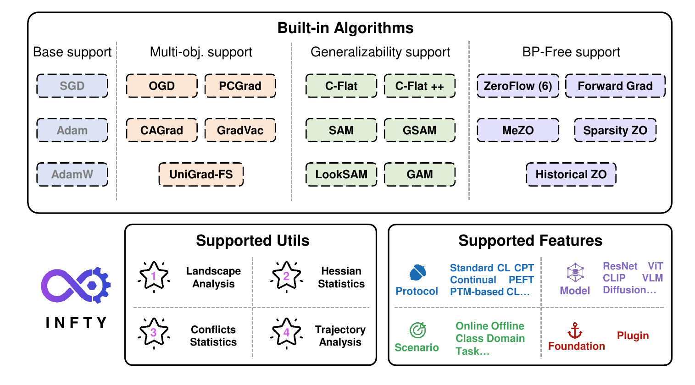
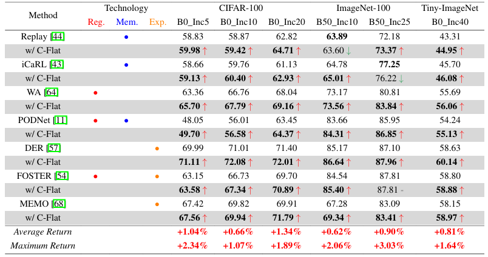
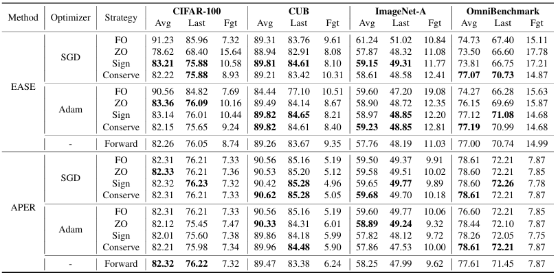
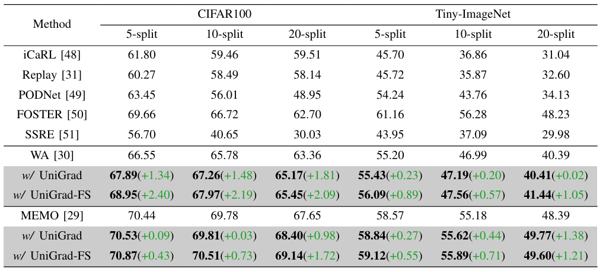

<div align="center">
  
</div>

<!--
<div align="center">
✨ <em>"The path to AGI is continual, INFTY paves the way."</em> ✨ </strong><br />
<em>— INFTY × AGI</em>
</div>
-->

<!--
[](https://git.io/typing-svg)
-->

<p align="center">
  
</p>

-----------

<p align="center">
  <a href="https://INFTY-AI.github.io/doc/"></a>
  <a href="https://pypi.org/project/infty/"></a>
  <a href="https://github.com/THUDM/INFTY/"></a>
  <a href="https://pytorch.org/get-started/locally/"></a>
  <a href="https://opensource.org/licenses/MIT"></a>
</p>

<div align="center">
  <center><h2>INFTY Engine: An Optimization Toolkit to Support Continual AI</h2></center>
</div>

- 🌟 Initial version of **INFTY** is released. (*Pre-print to be updated*)

# 🌈 What is INFTY?

<div align="center">

</div>
</br>

Wecome to **INFTY**, a flexible and user-friendly optimization engine tailored for Continual AI (*existing libraries treat optimizers as defaults configuration*). INFTY includes a suite of built-in optimization algorithms that directly tackle core challenges (e.g., catastrophic forgetting, stability–plasticity dilemma, generalization) in Continual AI. INFTY supports plug-and-play and theoretical analysis utilities, compatible with: i) various Continual AI, e.g., PTM-based CL, and Continual PEFT, Continual Diffusion, and Continual VLM etc.; ii) diverse models, e.g., ResNet, Transformer, ViT, CLIP, and Diffusion. INFTY provides a unified optimization solution in Continual AI, can serve as infrastructure for broad deployment.


# ✨ Features
- **Generality**: Built-in CL–friendly optimization algorithms, supporting a wide range of scenarios, models, methods, and learning paradigms.
    
- **Usability**: Portable, plugin-style design, enabling easy replacement of fixed options within existing pipelines.
    
- **Utilities**: Built-in tools for theoretical analysis and visualization, facilitating investigation and diagnostic insight into optimization behavior.

# 🧠 Algorithms
INFTY has implemented three mainstream algorithms currently:

<div align="center">
  
</div>


# 📚 Versatile Case (Ongoing Updates)
## Scenario 1: Typical Continual Learning
### Case 1: Generalizability support 
This category promotes unified and flat loss landscapes to enhance adaptation across tasks over time. These methods can be applied to most architectures and training platforms, either from scratch or with pre-trained models (PTMs). Details can be found in [C_Flat](https://arxiv.org/abs/2404.00986v1).
<div align="center">
  
</div>

### Case 2: BP-Free support
This category focuses on gradient approximation when backpropagation is not feasible. Combining with PTMs is strongly recommended to achieve better initialization and faster convergence. Details can be found in [ZeroFlow](https://arxiv.org/abs/2501.01045).
<div align="center">
  
</div>

### Case 3: Multi-objective support
This category mitigates gradient interference between old and new task objectives, with gradient manipulation applied solely to shared parameters. Details can be found in [UniGrad_FS](https://ieeexplore.ieee.org/abstract/document/10636267).
<div align="center">
  
</div>

## Scenario 2: Continual Text-to-Image Diffusion Model
INFTY empowers CIDM! A tiny demo shows how INFTY can be applied to train Concept-Incremental text-to-image Diffusion Models. Origin repo can be found in [CIDM](https://github.com/JiahuaDong/CIFC).
<div align="center">
  
</div>


## Scenario 3: Vision-Language Continual Learning
INFTY also supports multi-modal continual learning — ready for VLMs, AVLMs, and more.  Origin repo can be found in [DMNSP](https://github.com/RL-VIG/DMNSP).

| Method   | T1      | T2      | T3      | T4      | T5      | T6      | T7      | T8      | T9      | T10     | Avg     |
| -------- | :-----: | :-----: |  :-----: | :-----: | :-----: | :-----: | :-----: | :-----: | :-----: | :-----: | :-----: |
| DMNSP | **99.20** | 96.10 | **91.93** | 87.05 | 87.00 | 86.10 | 84.17 | 83.05 | 81.58 | 79.94 | 87.61 |
|+INFTY | **99.20** | **96.30** | 91.80 | **87.30** | **87.44** | **86.60** | **84.46** | **83.20** | **81.69** | **80.52** | **87.85** | 


# 🛠️ Installation

## Option 1: Using pip

```bash
pip install infty
```
## Option 2: Install from source
```bash
conda create -n infty python=3.8

conda activate infty

git clone https://github.com/THUDM/INFTY.git

cd infty && pip install .
```

# 🚀 Quick start
Thanks to the PILOT repo, we provide a simple example showcasing INFTY Engine. Hyperparameters for specific methods are configured in `workdirs/configs/infty/`.
```bash
cd infty 

pip install .[examples]

cd examples/PILOT

python main.py --config=exps/memo_scr.json --inftyopt=c_flat --workdir ../../workdirs
python main.py --config=exps/ease.json --inftyopt=zo_sgd_conserve --workdir ../../workdirs
python main.py --config=exps/icarl.json --inftyopt=unigrad_fs --workdir ../../workdirs

DRY_RUN=1 bash ../../workdirs/run_scripts/run_geometry_reshaping.sh
```
Tips: Feel free to use INFTY in your own projects following 🛠️ Installation or 🧩 Custom usage.

# 🧩 Custom usage
## Optimizers
Step 1. Wrap your base optimizer with an INFTY optimizer
```python
from infty import optim as infty_optim

base_optimizer = optim.SGD(
                filter(lambda p: p.requires_grad, self._network.parameters()), 
                lr=self.args['lrate'], 
                momentum=0.9, 
                weight_decay=self.args['weight_decay']
            )
optimizer = infty_optim.C_Flat(params=self._network.parameters(), base_optimizer=base_optimizer, model=self._network, args=self.args)
```
Step 2. Implement the create_loss_fn function
```python
def create_loss_fn(self, inputs, targets):
    """
    Create a closure to calculate the loss
    """
    def loss_fn():
        outputs = self._network(inputs)
        logits = outputs["logits"]
        loss_clf = F.cross_entropy(logits, targets)
        return logits, [loss_clf]
    return loss_fn
```
Step 3. Use the loss_fn to calculate the loss and backward
```python
loss_fn = self.create_loss_fn(inputs, targets)
optimizer.set_closure(loss_fn)
logits, loss_list = optimizer.step()
```

## Visualization plots
INFTY includes built-in visualization tools for inspecting optimization behavior:
- [x] **Loss Landscape**: visualize sharpness around local minima
- [x] **Hessian ESD**: curvature analysis via eigenvalue spectrum density
- [x] **Conflict Curves**: quantify gradient interference (supports PCGrad, GradVac, UniGrad_FS, CAGrad)
- [x] **Optimization Trajectory**: observe optimization directions under gradient shifts with a toy example

Default plot outputs are organized under:

```text
workdirs/plots/
  diagnostics/
  examples/
  pilot/
  experiments/
  custom/
```

```python
from infty import plot as infty_plot

infty_plot.visualize_landscape(
    optimizer=optimizer,
    model=self._network,
    create_loss_fn=self.create_loss_fn,
    loader=train_loader,
    task=self._cur_task,
    device=self._device,
    output_dir="workdirs/plots/diagnostics/landscape/demo",
)
infty_plot.visualize_esd(
    optimizer=optimizer,
    model=self._network,
    create_loss_fn=self.create_loss_fn,
    loader=train_loader,
    task=self._cur_task,
    device=self._device,
    output_dir="workdirs/plots/diagnostics/esd/demo",
)
infty_plot.visualize_conflicts(optimizer, task=self._cur_task, output_dir="workdirs/plots/diagnostics/conflicts/demo")
infty_plot.visualize_trajectory("cagrad", output_dir="workdirs/plots/diagnostics/trajectory/demo")
```

# 📝 Citation
If any content in this repo is useful for your work, please cite the following paper:

- `ZeroFlow:` Zeroflow: Overcoming catastrophic forgetting is easier than you think. ICML 2025 [[paper]](https://arxiv.org/abs/2501.01045)

- `C-Flat++:` C-Flat++: Towards a More Efficient and Powerful Framework for Continual Learning. Arxiv 2025 [[paper]](https://arxiv.org/abs/2508.18860)

- `C-Flat:` Make Continual Learning Stronger via C-Flat. NeurIPS 2024 [[paper]](https://arxiv.org/abs/2404.00986v2)

- `UniGrad-FS:` UniGrad-FS: Unified Gradient Projection With Flatter Sharpness for Continual Learning. TII 2024 [[paper]](https://ieeexplore.ieee.org/abstract/document/10636267)

# 🙏 Acknowledgements
We thank the following repos providing helpful components/functions in our work.

- [PILOT](https://github.com/LAMDA-CL/LAMDA-PILOT) /
[PyCIL](https://github.com/LAMDA-CL/PyCIL) /
[CIDM](https://github.com/JiahuaDong/CIFC) /
[DMNSP](https://github.com/RL-VIG/DMNSP) /
[GAM](https://github.com/xxgege/GAM) /
[ZO-LLM](https://github.com/ZO-Bench/ZO-LLM) /
[CAGrad](https://github.com/Cranial-XIX/CAGrad) /
[PyHessian](https://github.com/amirgholami/PyHessian)

# 📬 Contact us
If you have any questions, feel free to open an issue or contact the authors: Wei Li (ymjiii98@gmail.com) or Tao Feng (fengtao.hi@gmail.com).

# 🧾 License
This project is licensed under the MIT License.
